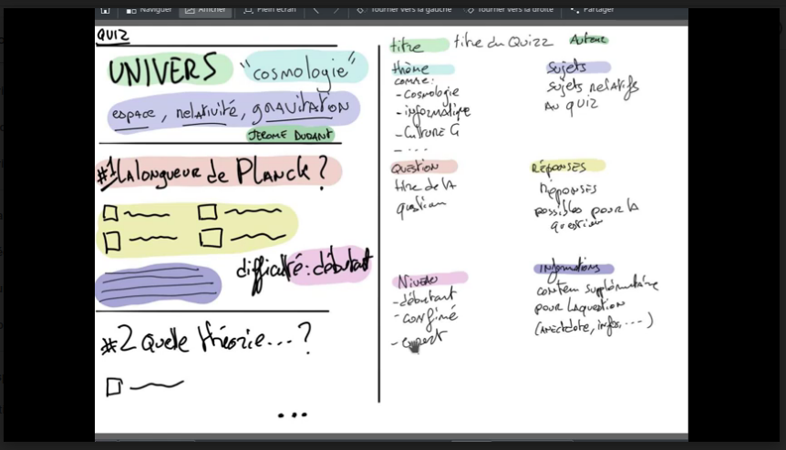
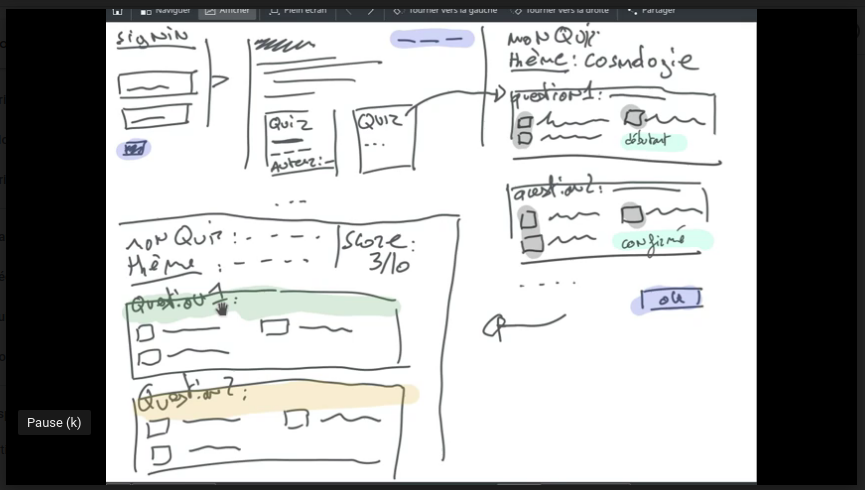

# OQuiz

Le client *Philippe*, demande à son assistant ( le Prof ) de lui créer un nouveau projet de Quizz. Le prof brainstorm avec son équipe de dev pour créer le projet. On analyse donc les spécificités.

A première vue, c'est un jeu qui va comporter des quizzes avec des questions suivant des thématiques. On pourra répondre aux quizzes, avec par exemple un score à la fin. Il y aura plusieurs sujets à ces quizzes.

On sera dans un premier temps, un utilisateur, donc on ne pourra que répondre aux quizz si on est connecté

On nous a dit que l'administration dans un premier temps se ferait par phpMyAdmin ( Qui est une interface pour modifier la BDD )

## 1. Prise de notes

Quest-ce que **doit faire** et quest-ce que **ne doit pas faire** notre application, et en fonction en définira des uses cases.

Un sujet c'est par exemple : Les étoiles, la gravitation, l'espace ...
Et la thématique serait : Cosmologie

**Ce qu'elle doit faire :**

- Permettre de se connecter à l'interface
- Permettre de distinguer différents roles
- Permettre de pouvoir choisir un quizz suivant son thème ou sa difficulté
- Permettre de pouvoir choisir entre plusieurs réponses pour répondre à un quizz
- Permettre de pouvoir consulter le résultat du quizz avec un score à la fin
- Permettre de pouvoir lister ses propres quizzes depuis son profil
- Permettre de choisir un sujet associé à une thématique
- Afficher l'auteur du quizz ( apparemment c'est important )

**Ce qu'elle ne doit pas faire :**

- Stocker le résultat des quizzes

**Ce qu'elle pourrait faire ( mais qui n'est pas demandé )**

- Noter un quizz ( juger si il était bien ou pas )
- Mettre en avant les quizzes bien notés
- Mesurer le temps de réponse à un quiz ( suivant le niveau de difficutés ) ou gérer un chronomètre par question
- En fonction de la difficulté on pourrait avoir plusieurs bonnes réponses
- Avoir une page de présentation
- Avoir une page de recherche
- Permettre de s'inscrire à une newsletter
- Permettre de proposer des quizzes recommandés ( en fonction des thèmes souvent utilisé par exemple )

**Notes au sujet de la structure des données :**

- Chaque quizz a :
  - un auteur
  - titre
  - des questions
  - un thème
  - des sujets ( tags )

- Chaque question :
  - difficulté
  - a une réponse
  - plusieurs propositions

## 2. Uses Cases

### En tant que visiteur je veux

- Accèder à un formulaire de création de compte
- Pouvoir s'inscrire
- Accèder à un formulaire de connexion afin de m'authentifier
- Pouvoir m'authentifier
- Accèder à une page d'accueil avec des quizzes
- Pouvoir consulter la liste des quizzes afin d'un selectionner un
- Pouvoir consulter un quizz afin de lire les questions
- Avoir un bouton de redirection vers la page de connexion si je consulte un quizz
- Cliquer sur le nom d'un auteur pour afficher tous ses quizzes
- Pourvoir consulter la liste des thèmes afin de lister les quizzes par thèmes
- Pouvoir consulter la liste des quizzes par thème
- Pouvoir visualiser les sujet du quizz sur la page du quizz
- Pouvoir visualiser la difficulté de chaque question

### En tant que membre je veux

- Accéder à une page de déconnexion
- Pouvoir selectionner un quizz afin d'y répondre
- Pouvoir visualiser le score aprés avoir répondu
- Pouvoir visualiser la correction aprés avoir répondu
- Accéder à ma page de profil afin de consulter mes données
- ( Si on a le temps ) Pouvoir créer quizz
- ( Si on a le temps ) Pouvoir créer des questions afin de les lier à un quizz
- ( Si on a le temps ) Pouvoir avoir accès à l'historique des mes quizzes, de mes résultats.

### En tant qu'admin ( et si on a le temps )

- Accéder à mon espace d'administration
- Valider un quizz créé par un utilisateur
- CRUD d'un utilisateur
- CRUD d'un thème
- CRUD d'un quizz
- CRUD d'une question

## 3. Les sprints
| En tant que | J'ai besoin de ... | Commentaire | Sprint |
|---|---|---|---|
| Visiteur | Accèder à un formulaire de création de compte | | 1 |
| Visiteur | Accèder à un formulaire de connexion afin de m'authentifier | | 1 |
| Visiteur | Accèder à une page d'accueil avec des quizzes | | 1 |
| Visiteur | Pouvoir consulter la liste des quizzes afin d'un selectionner un | | 1 |
| Visiteur | Pouvoir consulter un quizz afin d'accéder aux questions | | 1 |
| Visiteur | Avoir un bouton de redirection vers la page de connexion si je consulte un quizz | | 1 |
| Visiteur | Pourvoir consulter la liste des thèmes afin de lister les quizzes par thèmes  | | 1 |
| Visiteur | Pouvoir consulter la liste des quizzes par thème | | 1 |
| Visiteur | Pouvoir visualiser les sujet du quizz sur la page du quizz | | 1 |
| Visiteur | Pouvoir visualiser la difficulté de chaque question | | 1 |
| Visiteur | Pouvoir se connecter | | 2 |
| Visiteur | Pouvoir s'inscrire | | 2 |
| Visiteur | Cliquer sur le nom d'un auteur pour afficher tous ses quizzes | | 2 |
| Membre | Accéder à une page de déconnexion | | 2 |
| Membre | Pouvoir répondre à un quizz | | 2 |
| Membre | Pouvoir visualiser/interpréter le score aprés avoir répondu | | 2 |
| Membre | Pouvoir visualiser la correction aprés avoir répondu | | 2 |
| Membre | Accéder à ma page de profil afin de consulter mes données | | 2 |
| Membre | ( Si on a le temps ) Pouvoir créer quizz | | 3 |
| Membre | ( Si on a le temps ) Pouvoir créer des questions afin de les lier à un quizz | | 3 |
| Membre | ( Si on a le temps ) Pouvoir avoir accès à l'historique des mes quizzes, de mes résultats. | | 3 |
| Admin | Accéder à mon espace d'administration | | 4 |
| Admin | Valider un quizz créé par un utilisateur | | 4 |
| Admin | CRUD d'un utilisateur | | 4 |
| Admin | CRUD d'un thème | | 4 |
| Admin | CRUD d'un quizz | | 4 |
| Admin | CRUD d'une question | | 4 |

## 4. WireFrames

